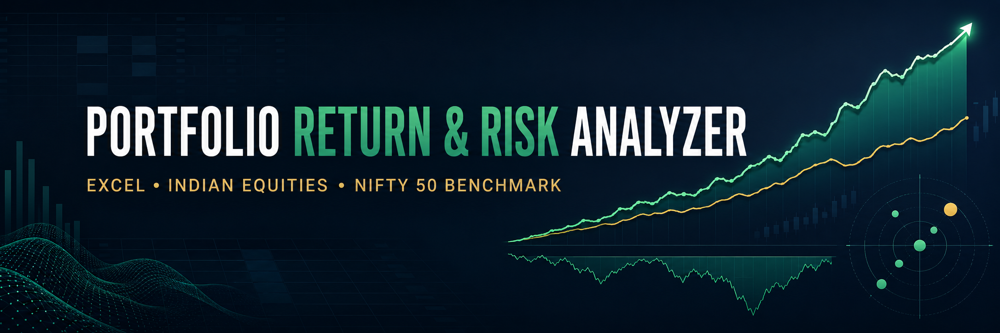

# Portfolio Return & Risk Analyzer | Excel

Built an Excel-based Portfolio Return & Risk Analyzer for a 5-stock Indian equity portfolio consisting of Reliance Industries, HDFC Bank, TCS, ICICI Bank, and Infosys.

• Analyzed 740 actual trading-day observations from January 2023 to December 2025 using historical adjusted stock prices and the NIFTY 50 as a benchmark.

• Calculated daily and annualized returns, portfolio volatility, Sharpe ratio, cumulative performance, and maximum drawdown using Excel formulas.

• Developed a weighted portfolio model with editable asset allocations, risk-free rate, and investment assumptions.

• Built a dashboard to compare portfolio performance and risk against the NIFTY 50 benchmark.

• Structured the workbook across dedicated sheets for price data, returns, portfolio construction, risk analysis, and dashboard reporting.
